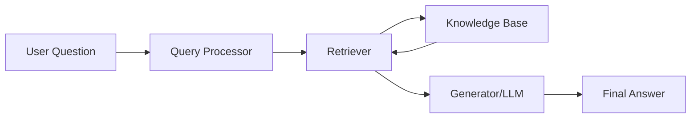

# RAG (Retrieval-Augmented Generation) - Complete Guide

## What is RAG? 🤔
Think of RAG like having a super-smart assistant who doesn't just rely on what they already know, but can also look up information in real-time to give you better answers!

RAG stands for Retrieval-Augmented Generation. It's like combining two superpowers:

- **Retrieval**: Finding relevant information from a database or documents
- **Generation**: Creating human-like responses using AI

Imagine you're writing an essay, but instead of only using what you remember, you can quickly search through all your textbooks and notes to find the exact information you need. That's exactly what RAG does for AI!

## With RAG vs Without RAG 🆚

### Without RAG (Traditional AI)
- Like a closed book exam 📚❌
- AI only knows what it learned during training
- Information can be outdated
- Might make up facts (hallucinate)
- Can't access new or specific company data
- Example: If you ask "What's our company's revenue this quarter?", a regular AI might say "I don't know" or make up numbers.

### With RAG (Smart AI)
- Like an open book exam 📚✅
- AI can search and retrieve real-time information
- Always has access to latest data
- More accurate and reliable answers
- Can access your specific documents and databases
- Example: The same question about company revenue would trigger the AI to search your financial documents and give you the exact, up-to-date numbers.

## Real-World Examples 🌍
1. Customer Support Chatbot
  - Without RAG: "I'm not sure about your specific warranty policy"
  - With RAG: Searches warranty database → "Your laptop has 2 years warranty remaining, expires March 2026"
2. Medical Assistant
  - Without RAG: Gives general medical advice
  - With RAG: Searches latest medical research → Provides current treatment guidelines
3. Legal Research
  - Without RAG: General legal knowledge
  - With RAG: Searches case law database → Finds relevant precedents and current laws
4. Company Knowledge Base
  - Without RAG: "I don't have access to your internal documents"
  - With RAG: Searches company docs → "According to our HR policy document, vacation days are..."

## Components of RAG 🔧
RAG has 4 main parts working together:

1. Knowledge Base 📚
   - Collection of documents, databases, or files
   - Examples: PDFs, websites, databases, spreadsheets
   - Think of it as a digital library
2. Retriever 🔍
   - The "search engine" component
   - Finds relevant information from the knowledge base
   - Like having a super-fast librarian
3. Generator 🤖
   - The AI that creates human-like responses
   - Usually a Large Language Model (LLM)
   - Takes retrieved info and makes it conversational
4. Orchestrator 🎭
   - The "conductor" that coordinates everything
   - Decides what to search for and how to combine results
   - Like a smart coordinator

## RAG Workflow 🔄
Here's how RAG works step-by-step:

### Step 1: Question Asked ❓
User: "What's our company's return policy for electronics?"

### Step 2: Query Processing 🔍
System analyzes: Need to find return policy info for electronics

### Step 3: Information Retrieval 📋
Searches knowledge base → Finds relevant policy documents
Retrieved: "Electronics can be returned within 30 days with receipt..."

### Step 4: Answer Generation 💬
AI combines retrieved info with natural language:
"Based on our current policy, electronics can be returned within 
30 days of purchase with your receipt..."

### Step 5: Response Delivered ✅
User gets accurate, up-to-date answer based on real company data

## Visual Workflow

## Why RAG is Awesome? ⭐
- 🎯 Accurate: Uses real, current data
- 🚀 Fast: Quick access to vast information
- 🔄 Updated: Always current information
- 💼 Practical: Works with your specific data
- 🛡️ Reliable: Reduces AI hallucinations
- 📈 Scalable: Can handle growing knowledge bases

## Simple Analogy 🎯
RAG is like having a research assistant who:
- Listens to your question
- Searches through all available resources
- Finds the most relevant information
- Explains it to you in simple terms
- Stays updated with the latest information

Instead of just relying on memory, they always check the facts first!
