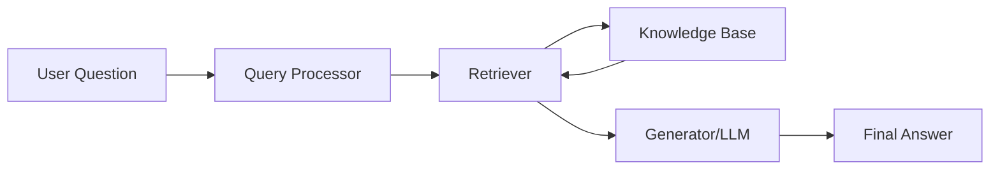

# RAG (Retrieval-Augmented Generation) - Complete Guide

## What is RAG? 🤔
Think of RAG like having a super-smart assistant who doesn't just rely on what they already know, but can also look up information in real-time to give you better answers!

RAG stands for Retrieval-Augmented Generation. It's like combining two superpowers:

- **Retrieval**: Finding relevant information from a database or documents
- **Generation**: Creating human-like responses using AI

Imagine you're writing an essay, but instead of only using what you remember, you can quickly search through all your textbooks and notes to find the exact information you need. That's exactly what RAG does for AI!

## Core Components of RAG
### 📄 Documents
- Documents form the foundation of any RAG system, serving as the primary knowledge source.

#### Advantages:
- Rich Information Source: Provide comprehensive, detailed knowledge on specific topics

- Authoritative Content: Can include verified, expert-reviewed materials

- Flexibility: Support various formats (PDFs, web pages, databases, structured data)

- Scalability: Can handle large document collections efficiently

- Version Control: Easy to update and maintain knowledge base currency

#### Disadvantages:
- Quality Dependency: System performance directly tied to document quality and relevance

- Storage Requirements: Large document collections require significant storage infrastructure

- Preprocessing Overhead: Documents need cleaning, formatting, and preparation before use

- Redundancy Issues: Overlapping or duplicate information can confuse retrieval

- Maintenance Burden: Requires ongoing updates to keep information current

### ✂️ Text Splitters
- Text splitters break down large documents into smaller, manageable chunks for processing and retrieval.

#### Advantages:
- Improved Retrieval Precision: Smaller chunks enable more targeted information retrieval

- Processing Efficiency: Reduces computational load on embedding and LLM operations

- Context Management: Helps maintain relevant context within token limits

- Parallel Processing: Enables concurrent processing of multiple document sections

- Memory Optimization: Prevents memory overflow with large documents

#### Disadvantages:
- Context Fragmentation: Important information may be split across multiple chunks

- Semantic Boundary Issues: Splitting may occur mid-sentence or mid-concept

- Chunk Size Optimization: Requires careful tuning for optimal performance

- Information Loss: Critical relationships between concepts may be broken

- Increased Complexity: Adds another layer of preprocessing and parameter tuning

### 🧮 Embeddings
- Embeddings convert text into dense vector representations that capture semantic meaning and relationships.

#### Advantages:
- Semantic Understanding: Captures meaning beyond simple keyword matching

- Similarity Computation: Enables efficient similarity search and ranking

- Language Agnostic: Works across different languages with appropriate models

- Noise Tolerance: Robust to minor variations in phrasing and terminology

- Scalable Search: Efficient vector operations enable fast similarity searches

#### Disadvantages:
- Model Dependency: Quality heavily depends on the underlying embedding model

- Computational Cost: Generating embeddings requires significant processing power

- Storage Overhead: Vector databases require substantial storage for large collections

- Dimensionality Challenges: High-dimensional vectors can suffer from curse of dimensionality

- Update Complexity: Changing embedding models requires reprocessing entire knowledge base

### 🗄️ Vector Store
- Vector stores are specialized databases designed to efficiently store, index, and search high-dimensional embeddings.

#### Advantages:
- Fast Similarity Search: Optimized algorithms (ANN, HNSW) enable rapid retrieval

- Horizontal Scaling: Can handle millions of vectors across distributed systems

- Flexible Querying: Supports various similarity metrics and filtering options

- Metadata Support: Can store and filter on additional document metadata

- Real-time Updates: Many systems support dynamic insertion and deletion

#### Disadvantages:
- Infrastructure Complexity: Requires specialized database setup and maintenance

- Memory Requirements: High-performance search often requires vectors in memory

- Accuracy Trade-offs: Approximate search algorithms may miss some relevant results

- Vendor Lock-in: Different vector databases have varying APIs and capabilities

- Cost Scaling: Storage and compute costs can grow significantly with data size

### 🔍 Retriever
- The retriever component searches the vector store to find the most relevant documents for a given query.

#### Advantages:
- Relevance Optimization: Advanced algorithms improve retrieval accuracy

- Query Flexibility: Supports various query types and reformulation strategies

- Ranking Control: Configurable scoring and ranking mechanisms

- Multi-modal Support: Can handle text, image, and other data types

- Performance Tuning: Adjustable parameters for precision-recall trade-offs

#### Disadvantages:
- Parameter Sensitivity: Requires careful tuning of similarity thresholds and result counts

- Query Dependency: Performance varies significantly based on query quality and specificity

- Bias Propagation: Can amplify biases present in the training data or documents

- Limited Context: May miss relevant information that requires broader context understanding

- Evaluation Challenges: Difficult to objectively measure retrieval quality

### 🤖 LLM (Large Language Model)
- The LLM generates the final response using both the original query and retrieved contextual information.

#### Advantages:
- Natural Language Generation: Produces human-like, coherent responses

- Context Integration: Effectively combines retrieved information with query understanding

- Reasoning Capabilities: Can perform inference and logical reasoning over retrieved content

- Adaptability: Works across diverse domains and question types

- Continuous Improvement: Benefits from ongoing model advances and fine-tuning

#### Disadvantages:
- Computational Intensity: Requires significant processing power and memory

- Hallucination Risk: May generate plausible but incorrect information despite retrieved context

- Context Length Limits: Token limits restrict the amount of retrieved information that can be used

- Cost Implications: API usage or model hosting can be expensive at scale

- Response Variability: Same input may produce different outputs across runs

## With RAG vs Without RAG 🆚

### Without RAG (Traditional AI)
- Like a closed book exam 📚❌
- AI only knows what it learned during training
- Information can be outdated
- Might make up facts (hallucinate)
- Can't access new or specific company data
- Example: If you ask "What's our company's revenue this quarter?", a regular AI might say "I don't know" or make up numbers.

### With RAG (Smart AI)
- Like an open book exam 📚✅
- AI can search and retrieve real-time information
- Always has access to latest data
- More accurate and reliable answers
- Can access your specific documents and databases
- Example: The same question about company revenue would trigger the AI to search your financial documents and give you the exact, up-to-date numbers.

## Real-World Examples 🌍
1. Customer Support Chatbot
  - Without RAG: "I'm not sure about your specific warranty policy"
  - With RAG: Searches warranty database → "Your laptop has 2 years warranty remaining, expires March 2026"
2. Medical Assistant
  - Without RAG: Gives general medical advice
  - With RAG: Searches latest medical research → Provides current treatment guidelines
3. Legal Research
  - Without RAG: General legal knowledge
  - With RAG: Searches case law database → Finds relevant precedents and current laws
4. Company Knowledge Base
  - Without RAG: "I don't have access to your internal documents"
  - With RAG: Searches company docs → "According to our HR policy document, vacation days are..."

## Components of RAG 🔧
RAG has 4 main parts working together:

1. Knowledge Base 📚
   - Collection of documents, databases, or files
   - Examples: PDFs, websites, databases, spreadsheets
   - Think of it as a digital library
2. Retriever 🔍
   - The "search engine" component
   - Finds relevant information from the knowledge base
   - Like having a super-fast librarian
3. Generator 🤖
   - The AI that creates human-like responses
   - Usually a Large Language Model (LLM)
   - Takes retrieved info and makes it conversational
4. Orchestrator 🎭
   - The "conductor" that coordinates everything
   - Decides what to search for and how to combine results
   - Like a smart coordinator

## RAG Workflow 🔄
Here's how RAG works step-by-step:

### Step 1: Question Asked ❓
User: "What's our company's return policy for electronics?"

### Step 2: Query Processing 🔍
System analyzes: Need to find return policy info for electronics

### Step 3: Information Retrieval 📋
Searches knowledge base → Finds relevant policy documents
Retrieved: "Electronics can be returned within 30 days with receipt..."

### Step 4: Answer Generation 💬
AI combines retrieved info with natural language:
"Based on our current policy, electronics can be returned within 
30 days of purchase with your receipt..."

### Step 5: Response Delivered ✅
User gets accurate, up-to-date answer based on real company data

## Visual Workflow

## Why RAG is Awesome? ⭐
- 🎯 Accurate: Uses real, current data
- 🚀 Fast: Quick access to vast information
- 🔄 Updated: Always current information
- 💼 Practical: Works with your specific data
- 🛡️ Reliable: Reduces AI hallucinations
- 📈 Scalable: Can handle growing knowledge bases

## Simple Analogy 🎯
RAG is like having a research assistant who:
- Listens to your question
- Searches through all available resources
- Finds the most relevant information
- Explains it to you in simple terms
- Stays updated with the latest information

Instead of just relying on memory, they always check the facts first!

